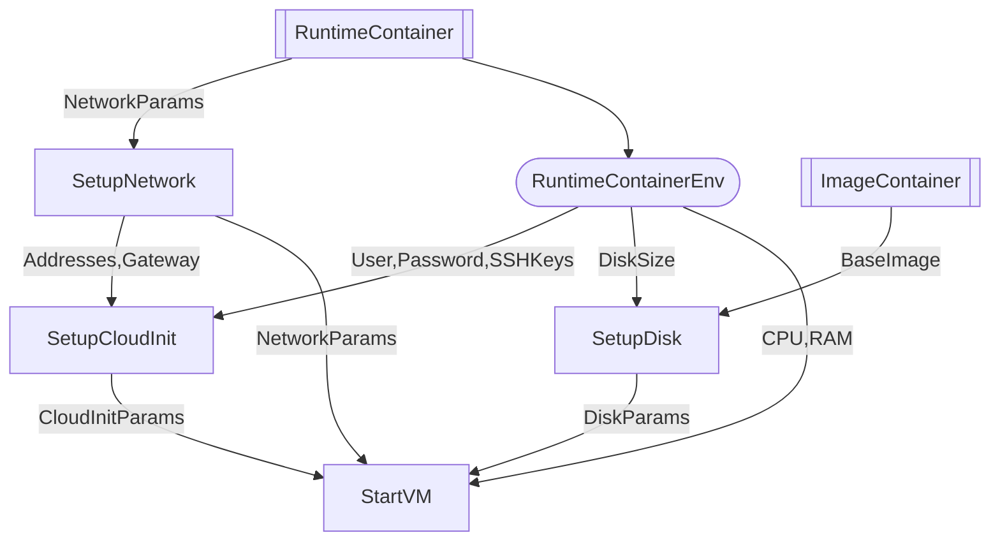

# DevMachines: QEMU Virtual Machines in Docker Containers  

**Run full-featured virtual machines (VMs) inside Docker containers**—combining the isolation of virtualization with the portability of containers. Ideal for development, testing, CI/CD, embedded systems, and security research.  

## 🔥 Key Features  
✅ **VM-as-a-Container** – Manage VMs like containers (`docker run`, `docker compose`)  
✅ **Configurable Resources** – Set CPU cores, RAM, and disk size via environment variables  
✅ **Snapshot-Based Storage** – Ephemeral or persistent disk options  
✅ **SSH & User Management** – Pre-configured users, passwords, and SSH keys  
✅ **Cloud-Init Support** – Customize VM boot behavior (networking, packages, users)  
✅ **Networking Flexibility** – Bridge, TAP, or NAT networking for advanced use cases  

## 🚀 Quick Start  
1. Download the `compose.yaml`:  
   ```sh
   wget https://raw.githubusercontent.com/utkin-tech/devmachines/main/compose.yaml
   docker compose up -d
   ```
2. Connect via SSH:  
   ```sh
   VM_IP=$(docker inspect -f '{{range.NetworkSettings.Networks}}{{.IPAddress}}{{break}}{{end}}' runtime)
   ssh user@"$VM_IP"
   ```

## 📌 Use Cases  
- **Developers**: Disposable dev environments with kernel/module testing  
- **CI/CD**: Isolated build/test runners with VM-level reproducibility  
- **Security Research**: Sandbox untrusted code in lightweight VMs  
- **Embedded/IoT**: Emulate ARM/x86 devices in containers  

## ⚙️ Configuration  
| Env        | Example          | Description                     |
| ---------- | ---------------- | ------------------------------- |
| `CPU`      | `2`              | CPU cores                       |
| `MEMORY`   | `4G`             | RAM (supports `G`/`M`)          |
| `STORAGE`  | `20G`            | Disk size (supports `G`)        |
| `USER`     | `dev`            | Default username                |
| `PASSWORD` | `secret`         | Default password                |
| `SSH_KEYS` | `ssh-ed25519...` | Comma-separated public SSH keys |

## 📂 Docs & Architecture  

### System Diagram



### Details
- [Networking Setup](/docs/networking.md) (Bridge/TAP)  
- [Cloud-Init Integration](/docs/cloudinit.md)  

## ❓ Why?  
- **No Hypervisor Overhead**: Uses Docker’s native capabilities + KVM acceleration  
- **Declarative Management**: Define VMs in `docker-compose.yml` like containers  
- **Cross-Platform**: Works anywhere Docker runs (Linux, macOS/WSL2, cloud)  

Yes! Adding licensing, author information, and contribution guidelines makes your project more transparent and professional. Here’s how to integrate these details into your repo description (typically in the `README.md`):

## 📜 License  
**DevMachines** is released under the **[MIT License](/LICENSE)**.  

## 👨‍💻 Author
**Daniil Utkin** ([@erlnby](https://github.com/erlnby))  
✉️ Email: [zolotoie@gmail.com](mailto:zolotoie@gmail.com)  

## 🤝 Contributing  
We welcome contributions! See [CONTRIBUTING.md](/CONTRIBUTING.md) for detailed guidelines.  
