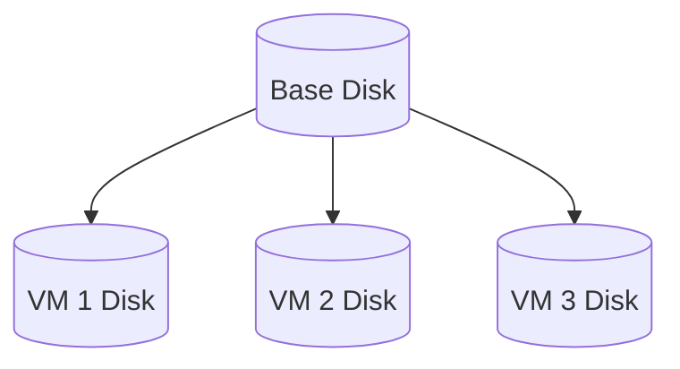

# DevMachines

Run full-featured QEMU virtual machines inside Docker containers. This project brings together the flexibility of virtualization with the simplicity and portability of container workflows.

Ideal for development, testing, CI/CD pipelines, embedded systems, and security research, it supports resource configuration, snapshot-based storage, and easy user/SSH setup—all manageable through standard Docker commands.

Whether you're testing custom kernels, isolating untrusted code, or spinning up disposable dev environments, this solution makes managing VMs as easy as running containers.

## Installation

Download the `compose.yaml` file and start the Docker environment:

```sh
wget https://raw.githubusercontent.com/utkin-tech/devmachines/main/compose.yaml
docker compose up -d
```

## Configuration

These variables are used to customize the runtime behavior of the `devmachines/runtime` Docker container. They can be passed via:  
- `docker run -e VAR=value`  
- Docker Compose `environment:` section

| Env        | Default | Example          | Description                                |
| ---------- | ------- | ---------------- | ------------------------------------------ |
| `CPU`      | `-`     | `2`              | Number of CPU cores                        |
| `MEMORY`   | `-`     | `2G`             | RAM size (supports `G` for GB, `M` for MB) |
| `STORAGE`  | `-`     | `10G`            | Disk storage size (supports `G` for GB)    |
| `USER`     | `-`     | `user`           | Default system username                    |
| `PASSWORD` | `-`     | `pass`           | Default user password                      |
| `SSH_KEYS` | `-`     | `ssh-ed25519...` | Comma-separated list of public SSH keys    |

## Image and disk

In `devmachines`, we use QEMU's `Backing File` function to reduce VM disk size. This allows us to reuse the same OS image across multiple VMs.



Every `devmachines/runtime` container attempts to find an image file (in QCOW2 format) in the `/image` path (currently only `/image/ubuntu.img` is supported) and creates a VM disk in `/disks` using the following command (example):

```bash
qemu-img create -b /image/ubuntu.img -F qcow2 -f qcow2 /disks/disk.img 10G
```

You can configure the initial disk size using the `STORAGE` environment variable. It supports size definitions in [`docker/go-units`](https://pkg.go.dev/github.com/docker/go-units#RAMInBytes) format. If the file `/disks/disk.img` already exists, `devmachines/runtime` takes no action, even if the `STORAGE` value has changed.

## Setup Diagram


## Get container IP

```sh
docker inspect --format='{{range .NetworkSettings.Networks}}{{.IPAddress}}{{end}}' runtime
```

## Create TAP interface inside container

Start container
```sh
docker run -it --name iptest --cap-add NET_ADMIN --device /dev/net/tun --device /dev/kvm alpine
```

Install iproute tool
```sh
apk add iproute2
```

Create bridge and tap interfaces
```sh
ip link add name br0 type bridge
ip link set dev br0 up
ip link set eth0 master br0
ip tuntap add dev tap0 mode tap
ip link set tap0 master br0
ip link set dev tap0 up
ip addr flush dev eth0
```

For debug add ip to bridge
```sh
ip addr add 172.17.0.2/16 dev br0
ip route add default via 172.17.0.1
```

## Start QEMU inside container

Test KVM
```sh
qemu-system-x86_64 \
    -m 2048 \
    -smp 2 \
    -enable-kvm \
    -nographics
```

Start VM
```sh
qemu-system-x86_64 \
    -m 2048 \
    -smp 2 \
    -drive file=/disks/disk.img,format=qcow2,if=virtio \
    -drive file=/disks/cloudinit.iso,format=raw,if=virtio \
    -netdev tap,id=net0,ifname=tap0,script=no,downscript=no \
    -device virtio-net-pci,netdev=net0 \
    -qmp unix:/tmp/qmp-sock,server,wait=off \
    -enable-kvm \
    -nographic
```

## Inspect image content

```sh
docker run -ti --rm  -v /var/run/docker.sock:/var/run/docker.sock docker.io/wagoodman/dive devmachines/ubuntu
```
