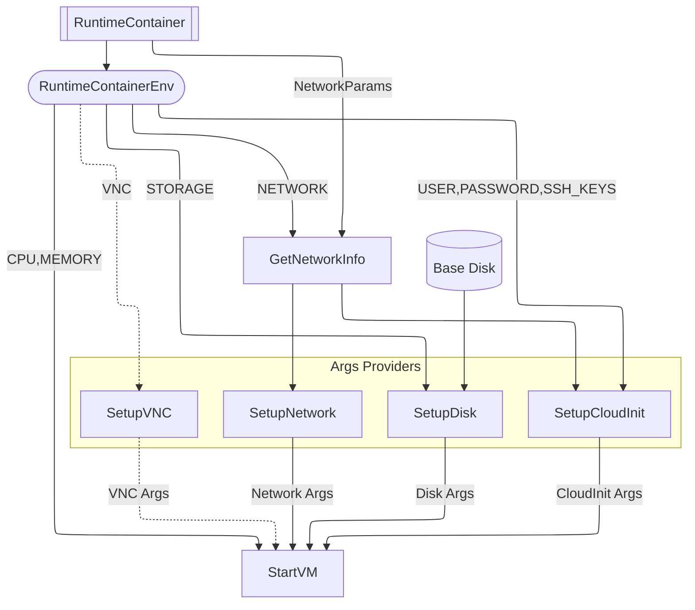

# DevMachines: QEMU Virtual Machines in Docker Containers

**Run full-featured virtual machines (VMs) inside Docker containers**—combining the isolation of virtualization with the portability of containers. Ideal for development, testing, CI/CD, and security research.

## Key Features
- **VM-as-a-Container** – Manage VMs like containers (`docker run`, `docker compose`)
- **Configurable Resources** – Set CPU cores, RAM, and disk size via environment variables
- **Snapshot-Based Storage** – Ephemeral or persistent disk options
- **SSH & User Management** – Pre-configured users, passwords, and SSH keys
- **Cloud-Init Support** – Customize VM boot behavior (networking, packages, users)
- **Networking Flexibility** – Bridge or NAT networking for advanced use cases

## Quick Start
1. Download the `compose.yaml`:
   ```sh
   wget https://raw.githubusercontent.com/utkin-tech/devmachines/main/compose.yaml
   docker compose up -d
   ```
2. Connect via SSH:
   ```sh
   VM_IP=$(docker inspect -f '{{range.NetworkSettings.Networks}}{{.IPAddress}}{{break}}{{end}}' runtime)
   ssh user@"$VM_IP"
   ```

## Use Cases
- **Developers**: Disposable dev environments with kernel/module testing
- **CI/CD**: Isolated build/test runners with VM-level reproducibility
- **Security Research**: Sandbox untrusted code in lightweight VMs

## Configuration

| Env        | Example          | Validation             | Default | Description                                     |
| ---------- | ---------------- | ---------------------- | ------- | ----------------------------------------------- |
| `CPU`      | `2`              | required               |         | CPU cores                                       |
| `MEMORY`   | `4G`             | required, validBytes   |         | RAM size                                        |
| `STORAGE`  | `20G`            | required, validBytes   |         | Disk storage size                               |
| `USER`     | `dev`            | required               |         | Default username                                |
| `PASSWORD` | `secret`         | required               |         | Default password                                |
| `SSH_KEYS` | `ssh-ed25519...` | required               |         | Comma-separated public SSH keys                 |
| `NETWORK`  |                  | required, validNetwork | `NAT`   | Network type                                    |
| `VNC`      | `:77`            |                        |         | QEMU-style argument for `-vnc`                  |
| `PORTS`    | `2222:22`        | validPorts             |         | Port mappings (see [Valid Ports](#valid-ports)) |

### Valid Bytes

Values for `MEMORY` and `STORAGE` must be human-readable strings representing sizes in bytes. Supported suffixes:
- `K` (kibibytes)
- `M` (mebibytes)
- `G` (gibibytes)
- `T` (tebibytes)

Notes:
- Units are case-insensitive
- The `b` suffix is optional (e.g., `4G` and `4GB` are equivalent)
- Validation uses `units.RAMInBytes` from `github.com/docker/go-units`

### Valid Network

Accepted values for `NETWORK`:
- `NAT` (default)
- `BRIDGE`

### Valid Ports

Comma-separated Docker-style port mappings (e.g., `2222:22,8080:80`).

Notes:
- Only takes effect when `NETWORK` is set to `NAT`.
- Validation uses `nat.ParsePortSpec` from `github.com/docker/go-connections/nat`.

## Docs & Architecture

### System Diagram



### Details
- [Networking Setup](/docs/networking.md) (Bridge/TAP)
- [Cloud-Init Integration](/docs/cloudinit.md)

## Why?
- **No Hypervisor Overhead**: Uses Docker’s native capabilities + KVM acceleration
- **Declarative Management**: Define VMs in `compose.yaml` like containers
- **Cross-Platform**: Works anywhere Docker runs (Linux, macOS/WSL2, cloud)

## License
**DevMachines** is released under the **[MIT License](/LICENSE)**.

## Author
**Daniil Utkin** ([@erlnby](https://github.com/erlnby))

Email: [zolotoie@gmail.com](mailto:zolotoie@gmail.com)

## Contributing
We welcome contributions! See [CONTRIBUTING.md](/CONTRIBUTING.md) for detailed guidelines.
