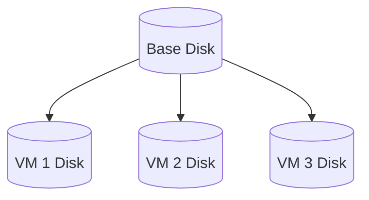

# Storage

## Image and disk

In `devmachines`, we use QEMU's `Backing File` function to reduce VM disk size. This allows us to reuse the same OS image across multiple VMs.



Every `devmachines/runtime` container attempts to find an image file (in QCOW2 format) in the `/image` path (currently only `/image/ubuntu.img` is supported) and creates a VM disk in `/disks` using the following command (example):

```bash
qemu-img create -b /image/ubuntu.img -F qcow2 -f qcow2 /disks/disk.img 10G
```

You can configure the initial disk size using the `STORAGE` environment variable. It supports size definitions in [`docker/go-units`](https://pkg.go.dev/github.com/docker/go-units#RAMInBytes) format. If the file `/disks/disk.img` already exists, `devmachines/runtime` takes no action, even if the `STORAGE` value has changed.
